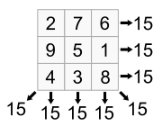

Create a 4 x 4 square grid filled with distinct positive integers in the range such that each cell contains a different integer and the sum of the integers in each row, column and diagonal is equal.

RTFM https://en.wikipedia.org/wiki/Magic_square
